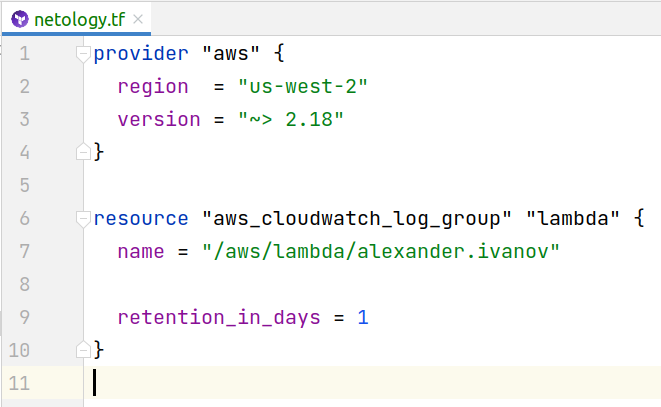
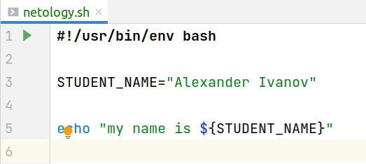
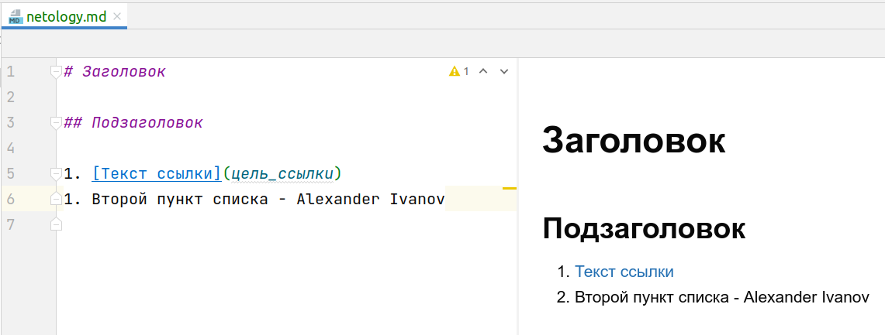
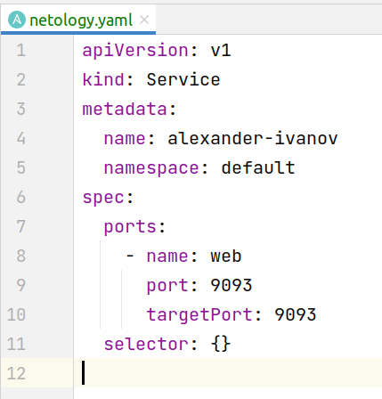
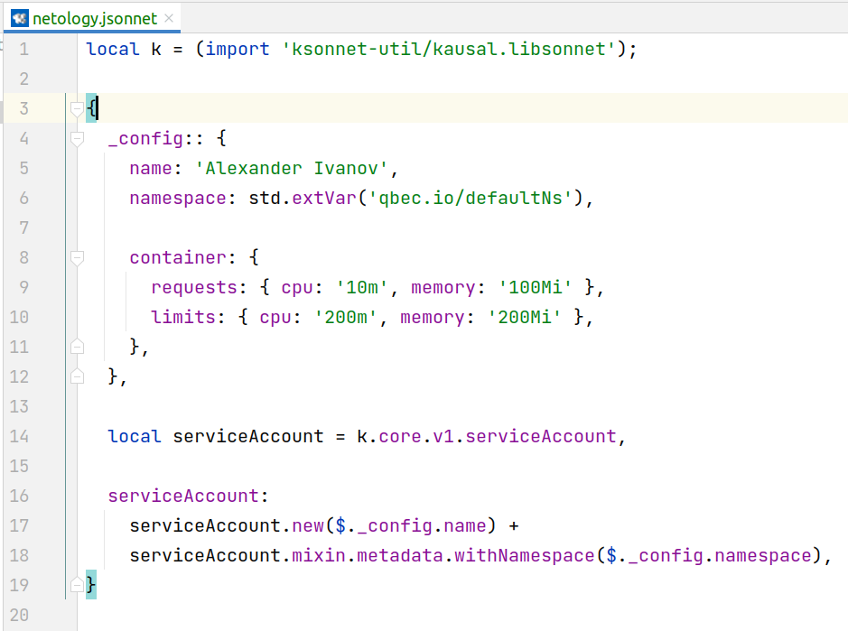

# Домашнее задание к занятию «1.1. Введение в DevOps»

#### [Само задание](./task)

---

## Задание №1 - Подготовка рабочей среды

- Terraform: 
- Bash: 
- Markdown: 
- Yaml: 
- Jsonnet: 

## Задание №2 - Описание жизненного цикла задачи (разработки нового функционала)

Чтобы избежать рассинхрона окружения - все упакуем в докер. Причем упаковка будет автоматическая, средствами CI. После сборки образа прогоним тесты, также средствами CI. Надо следить за процентом покрытия кода тестами, чтобы он не опускался ниже 85%. Также надо следить за миграциями, чтобы они были обратимыми (по крайней мере на один релиз назад).

Образ, прошедший все этапы CI, деплоится в песочнице (автоматически) - там будут гонять его тестеры.

После успеха в песочнице по простой команде/клику в интерфейсе - образ накатывается на стейджинг. Нужна будет реплика БД с прода на стейджинг, чтобы максимально быть приближенным к проду. Конечно, она тоже должна делаться автоматически, например по ночам. Также неплохо бы иметь механизм ручного запуска репликации, чтобы в любой момент получить актуальную БД на стейджинге. Возможно в будущем перейдем на сине-зеленый деплой.

После выливания на стеджинг менеджер прогоняет свои демо-сценарии перед показом клиенту. Если от менеджера поступил сигнал, что все ок, то выливаем на прод текущий образ. До его отмашки, что показ прошел успешно, ничего на прод не льем.

При всем при этом надо уделить внимание правам доступа ко всем ресурсам от разных команд.
